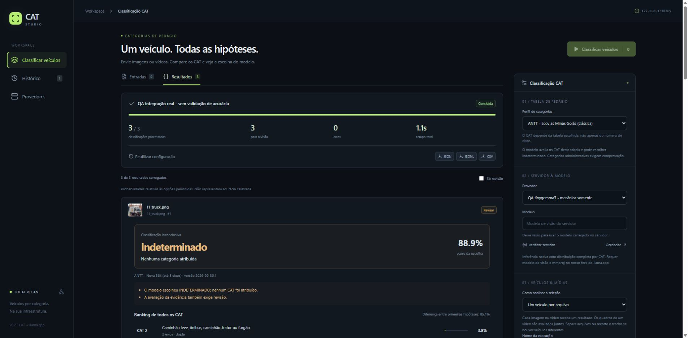
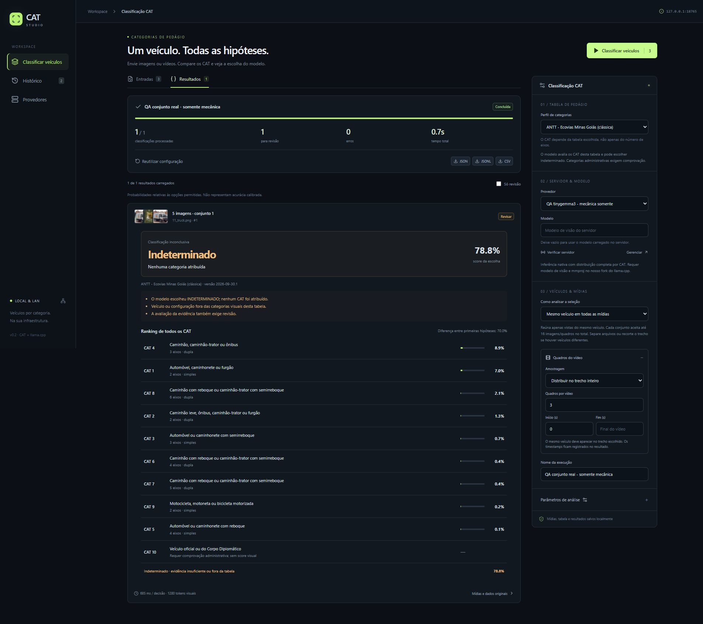

# Validação CAT Studio

Data: 30/09/2026. Branch: `codex/toll-cat`, derivado de `codex/decision-vision`.

## Verificado

- 19 testes de backend/API passaram: seis testes existentes e treze cenários CAT (incluindo parametrização de seis distribuições inválidas).
- Perfis independentes: CAT 9 motocicleta na Ecovias Minas Goiás e 7 eixos na Nova 364; classes administrativas fora das opções visuais.
- Ranking completo, soma dos scores com indeterminado, limiar de revisão, diferença entre primeiras hipóteses, eixos suspensos, classificação inconclusiva e recusa de distribuições inconsistentes.
- Contrato CAT fixado no backend, mesmo se o cliente pedir outra estrutura, geração JSON ou greedy.
- Uploads, lotes, um resultado por vídeo, quadros uniformes entre início e fim, lote conjunto e recusa de mais de 16 imagens/quadros por contexto.
- Tabela completa e versão persistidas com a execução; resultados preservados após reinício; JSON/JSONL e CSV por candidato.
- Build de produção React/TypeScript passou. A suíte completa com o servidor real passou em 25 testes; a comparação serial F32 foi ignorada porque não foi iniciado um segundo servidor de referência.
- Integração real em Windows CPU com `llama-server` deste fork, tinygemma3 Q8_0 e mmproj compatível: duas imagens independentes e um vídeo com três quadros produziram três resultados, zero erros, cada resultado com ranking de 12 CAT do perfil Nova 364 e hipótese indeterminado.
- Pelo fluxo da interface, duas imagens e três quadros do vídeo em conjunto produziram um resultado no perfil clássico, dez categorias na lista e 1.280 tokens visuais.
- Troca de perfil, reutilização de execução, histórico e resultados conferidos no navegador; sem erros/warnings no console. Layout responsivo verificado em 390 x 844, sem overflow horizontal da página.

## Evidência da interface

O teste real foi mantido em dados QA separados da biblioteca normal. A fixture contém imagens pequenas e um vídeo de teste; os resultados indeterminados não medem desempenho de classificação de veículos.

- A edição normal respondeu HTTP 200 em localhost e nos endereços LAN 192.168.20.28 e 192.168.20.21, verificados a partir do próprio host. Não foi feito teste físico de outra máquina.

## Limites

Não foi validada acurácia de CAT, calibração de scores, contagem de eixos em oclusão/noite/chuva, generalização de praça/câmera, ou modelo de produção/GPU. Não há treinamento ou download automático de um modelo dedicado. A tarefa usa o VLM configurado no servidor.

Não há segmentação/rastreamento de várias passagens em um arquivo. O operador deve fornecer um veículo por arquivo ou grupo e selecionar um trecho adequado. Não se infere condição administrativa, isenção, carga ou tarifa final a partir de aparência. Classes administrativas constam na tabela e exportação com score nulo.

As duas tabelas são snapshots oficiais conferidos na data indicada. Novas concessões ou mudanças exigem perfil revisado e nova versão. O resultado preserva o snapshot usado, mesmo se a tabela padrão mudar depois.
