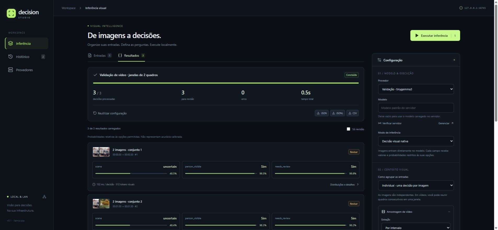
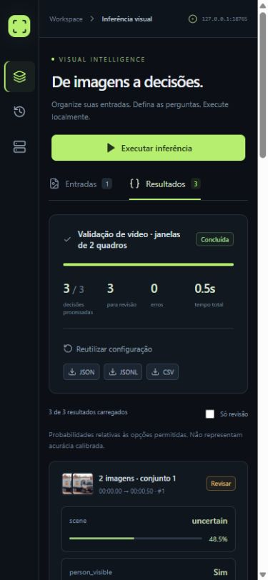

# Validação da entrega — 2026-09-29

Base do servidor: `thecodacus/llama.cpp:parallel-decision`, commit `ad129b08d9f134cd298d1f8a85efc52b1b66e18e`. Alterações em `matheusfalcaopinto/llama.cpp:codex/decision-vision`.

## Ambiente e compilação

- Windows x64, LLVM-MinGW `20260922` (Clang 23.1.2), CMake 4.4.3, Ninja 1.13.2.
- Build Release CPU, `GGML_NATIVE=OFF`, `GGML_OPENMP=OFF`, `BUILD_SHARED_LIBS=OFF`, `LLAMA_BUILD_UI=OFF`, `LLAMA_USE_PREBUILT_UI=OFF`, `LLAMA_OPENSSL=OFF`.
- Com MinGW, foram definidos `-D_WIN32_WINNT=0x0A00 -DWINVER=0x0A00` nas flags C/C++ para `CreateFile2` do cpp-httplib.
- `llama-server.exe` e `llama-parallel-decision.exe`: compilação concluída. `llama-quantize.exe` também compilado para a referência numérica.
- O binário de validação sem OpenSSL não baixa modelos via HTTPS: arquivos locais foram usados. O código mantém as opções normais de build com OpenSSL/CUDA.
- Python 3.12.13; dependências em `uv.lock`. Node.js 24.19.0, npm 11.17.0; dependências em `package-lock.json`.
- `npm run build`: TypeScript e Vite passaram. Sem erros/avisos de console na validação visual.

## Testes automatizados

`tests/test_studio.py` + `tests/test_native.py`: **13 passaram**, com uma advertência de depreciação do adaptador httpx do Starlette TestClient (não uma falha da aplicação).

| Verificação | Evidência/resultado |
|---|---|
| Provedores e chaves | Salvar/preservar/limpar chave; chave não aparece na resposta pública. |
| Upload | Imagens válidas, nomes/caminhos relativos, arquivo corrompido rejeitado. |
| Grupos | Duas imagens na mesma decisão, ordem preservada; limite de 16 validado. |
| Persistência/exportação | Resultados, miniaturas, JSON, JSONL, CSV e histórico verificados. |
| Cancelamento da aplicação | Requisição pendente cancelada; execução seguinte continua funcionando. |
| Reinício | Execução pendente marcada interrompida, sem apagar resultados. |
| Vídeo | Vídeo MJPEG local, amostragem 0/0,5/1 s, janelas de 2+1 e aviso de limite. |
| Decisão nativa | Imagem única, imagens distintas em lote, duas imagens em conjunto e contexto textual no mesmo pedido. |
| Uso real de visão | Trocar a imagem altera a distribuição em mais de 0,0001. |
| Isolamento em lote | Cada contexto visual coincide com sua execução isolada no mesmo servidor. |
| Scores | Distribuições tree somam 1; média esperada separada do inteiro escolhido; greedy sem distribuição. |
| Erros e recuperação | URL externa, mídia corrompida, áudio, contexto vazio, excesso de imagens/tokens e tree_max inválido. Requisição seguinte funciona. |
| Compatibilidade básica | Contextos textuais, cache textual, repetição estável e chat visual após decisões. |
| Referência sequencial | 32 sequências de decisão versus 3 (uma sequência livre para alternativas), mesmos valores, diferença absoluta de probabilidade < 0,0001 em FP32. |

O fixture é [`ggml-org/tinygemma3-GGUF`](https://huggingface.co/ggml-org/tinygemma3-GGUF), com `tinygemma3-Q8_0.gguf`, `mmproj-tinygemma3.gguf`, `test/11_truck.png` e `test/91_cat.png`. É um modelo de teste, não uma medida de qualidade visual. As classificações visíveis nos screenshots não devem ser usadas para avaliar acurácia.

### Referência numérica

A comparação inicial Q8_0 paralelo/sequencial teve as mesmas decisões, mas apresentou diferença máxima de aproximadamente **0,01008** na probabilidade (1,008 ponto percentual). Reexpandindo os mesmos pesos para FP32, usando KV FP32 e `-fa off`, a diferença medida caiu para aproximadamente **0,000036**; o teste usa tolerância absoluta de **0,0001**.

Isso é evidência de dependência numérica do caminho de execução/precisão, não equivalência bit a bit de todos os backends. O teste estrito requer a configuração FP32 abaixo. Em Q8_0, os demais 12 testes passaram; o teste estrito é pulado se o modelo anunciado não é FP32. Escolhas próximas de um empate podem variar com quantização, batching, cache e backend.

```powershell
# Gera uma referencia FP32 a partir do mesmo fixture; nao recupera precisao perdida no treino/quantizacao.
llama-quantize.exe --allow-requantize tinygemma3-Q8_0.gguf tinygemma3-F32.gguf F32

# Execute dois servidores, portas 18082 e 18083, com estes parametros comuns:
# -m tinygemma3-F32.gguf --mmproj mmproj-tinygemma3.gguf -c 8192
# --parallel 1 --batch-size 1024 --ubatch-size 512 --threads 4
# -ctk f32 -ctv f32 -fa off
# Um com --decision-seqs 32; o outro com --decision-seqs 3.
$env:LLAMA_TEST_URL = 'http://127.0.0.1:18082'
$env:LLAMA_TEST_REFERENCE_URL = 'http://127.0.0.1:18083'
$env:LLAMA_TEST_MODEL_DIR = 'C:\caminho\para\fixture'
uv run pytest -q
```

## Interface e rede

- Configuração do provedor, descoberta de modelos e declaração de capacidade visual verificadas pela interface.
- Inferência conjunta de duas imagens pela interface: 1/1 resultado, 512 tokens visuais.
- Vídeo de 3 segundos, intervalo 0,5 s e janelas de 2: 3/3 resultados, timestamps 0–0,5 / 1–1,5 / 2–2,5 s.
- Layout desktop e viewport de 390×844 verificados, sem overflow horizontal.
- Upload multipart validado pela API. A atribuição automática de arquivos no seletor do Chrome não foi concluída porque a extensão não tem permissão de acesso a URLs de arquivos; não foi alterada essa permissão. A abertura do seletor pela interface funcionou. Testar o envio manual pelo navegador do usuário permanece recomendado.
- Launcher Windows iniciou o processo oculto, servindo frontend/API na mesma porta. HTTP 200 na página e `/api/health` via `127.0.0.1:8765` e `192.168.20.21:8765`, a partir desta máquina. Não foi realizado um teste físico de outra máquina; firewall e roteamento LAN não foram alterados.
- Dados de QA separados em `.tools/qa-data`, sem misturar resultados do fixture ao histórico normal da aplicação.





## Limitações não validadas

- Ainda falta o GGUF/mmproj de produção ou endereço do servidor real do usuário; não houve validação de qualidade com esse modelo.
- CUDA/Metal/Vulkan, M-RoPE, grandes crops, famílias recurrent/hybrid e modelos de produção maiores não foram executados. O código reutiliza os helpers de posições multimodais, mas isso não comprova compatibilidade universal.
- Não houve teste exaustivo de exaustão de VRAM/RAM ou fuzzing de mídia. Os testes cobrem limites HTTP/contexto e recuperação de erros, não todos os modos de falha de um backend.
- O cancelamento nativo é cooperativo e implementado entre etapas/lotes; a suíte cobre cancelamento do cliente, mas não mede latência máxima de interrupção de kernels no servidor.
- Sem calibração de scores, benchmark de desempenho, compreensão temporal validada ou tracking. Tempos exibidos com o fixture não representam modelos de produção.
- Sem cache visual entre requisições, autenticação multiusuário, RTSP, áudio ou retomada automática após reinício.
